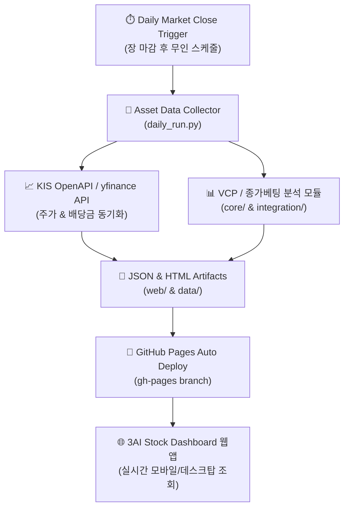

# 📊 [3AI 적용루프 1차 기획안] Item ③ Finance stock_dashboard: GitHub Pages + 자산/배당 무인 자동 모니터링 구축

> **기획 작성자**: 안티 (Antigravity Dev)  
> **1차 교차검증 승인자**: 코니 누나 (Auditor - 1차 검토 대기)  
> **2차 최종 승인자**: 만복이 형 (PM/Lead - 2차 승인 대기)  
> **지시 출처**: 바로보기님 실시간 지시 (`msg2118`: 2 ➔ 4 ➔ 3 ➔ 1 순서 기획안 제출 - 3번째 제출)  

---

## 1. 개요 및 목적

개인 주식 자산 및 배당금 현황, VCP/종가베팅 분석 데이터를 로컬 PC 의존 없이 **GitHub Pages 정적 웹 호스팅(무상)** 및 무인 데이터 갱신 파이프라인으로 24/7 실시간 모니터링할 수 있는 `stock_dashboard` 모니터링 체계를 구축합니다.

---

## 2. 세부 파이프라인 아키텍처

---

## 3. 핵심 기능 구성

1. **GitHub Pages 정적 대시보드 (`Improve_stock/web/index.html`)**:
   - 실시간 포트폴리오 총 평가금액, 당일 손익, 월별 예상 배당금 캘린더 Visualizing UI.
   - 종가베팅 / VCP 패턴 매수 시그널 하이라이트.
2. **무인 데이터 수집 & 듀얼 폴백 (`Improve_stock/daily_run.py`)**:
   - KIS (한국투자증권) API 1순위 수집 ➔ 실패 시 `yfinance` / `pykrx` 2순위 자동 폴백.
   - JSON 실측 데이터 갱신 (`data/portfolio_summary.json`).
3. **자산 드로다운 & 배당금 수령 알림 서비스**:
   - 일일 변동성 기준 초과 시 텔레그램 / n8n 무인 알림 연동.

---

## 4. 자가 실측 검증 계획 (Proof of Execution Plan)

1. **데이터 수집 로컬 실행**: `python D:\AI\Improve_stock\daily_run.py` ➔ Code 0 + JSON/HTML 생성 확인.
2. **HTML 문법 및 렌더링 파싱**: BeautifulSoup HTML 파싱 ➔ Code 0.
3. **물리적 파일 & SHA256**: `STOCK_DASHBOARD_PLAN.md` 실물 검증 및 SHA256 등록.

---

## 5. 제안 변경 파일 목록

- `[NEW]` [STOCK_DASHBOARD_PLAN.md](file:///D:/AI/Improve_stock/STOCK_DASHBOARD_PLAN.md) : Finance stock_dashboard 1차 기획안 (순서 3번째)
- `[MODIFY]` [daily_run.py](file:///D:/AI/Improve_stock/daily_run.py) : 주가/배당금 수집 및 HTML 갱신 통합 스크립트
- `[MODIFY]` [index.html](file:///D:/AI/Improve_stock/index.html) : GitHub Pages 대시보드 렌더링 UI
